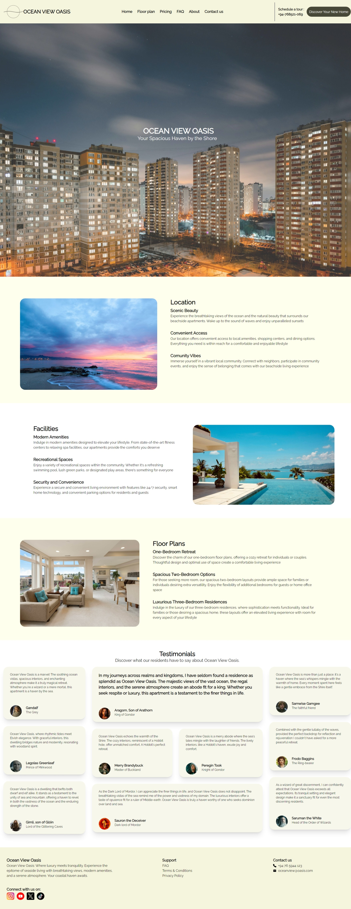
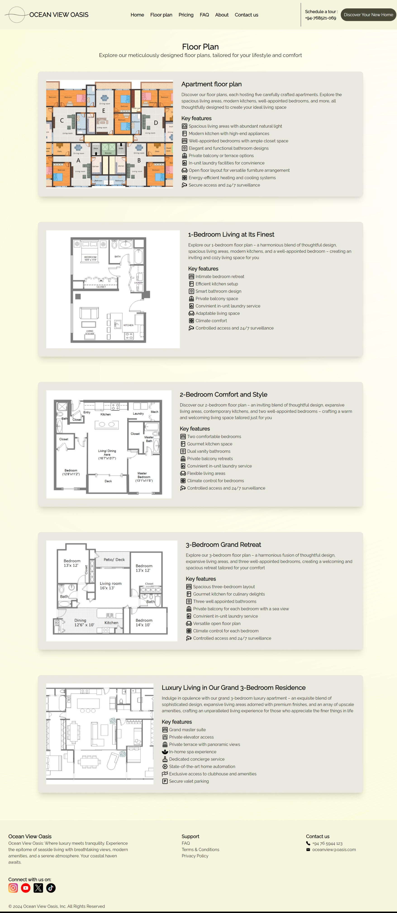
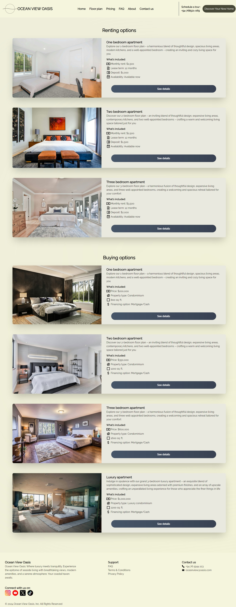
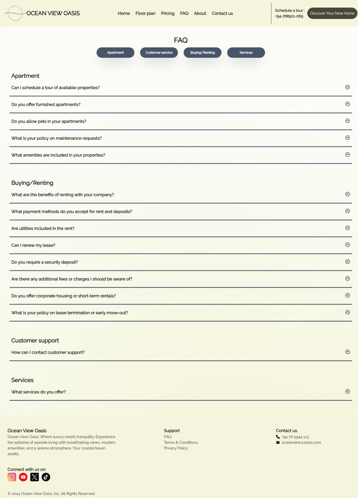
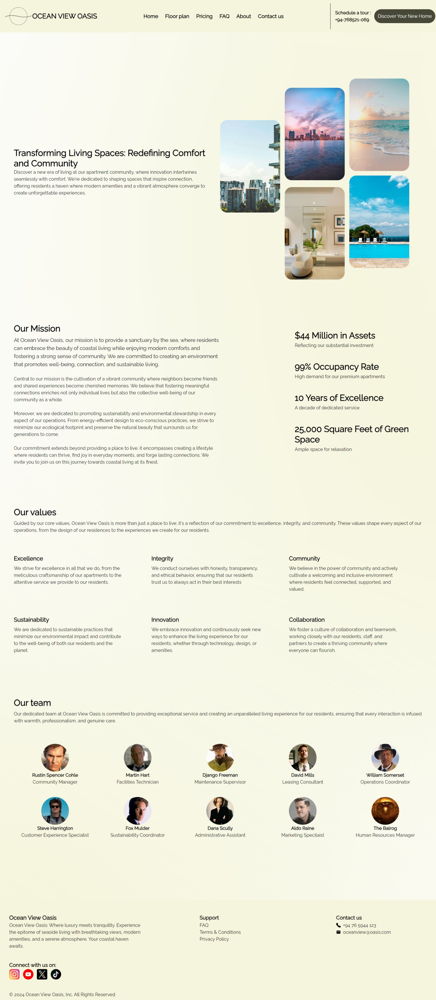
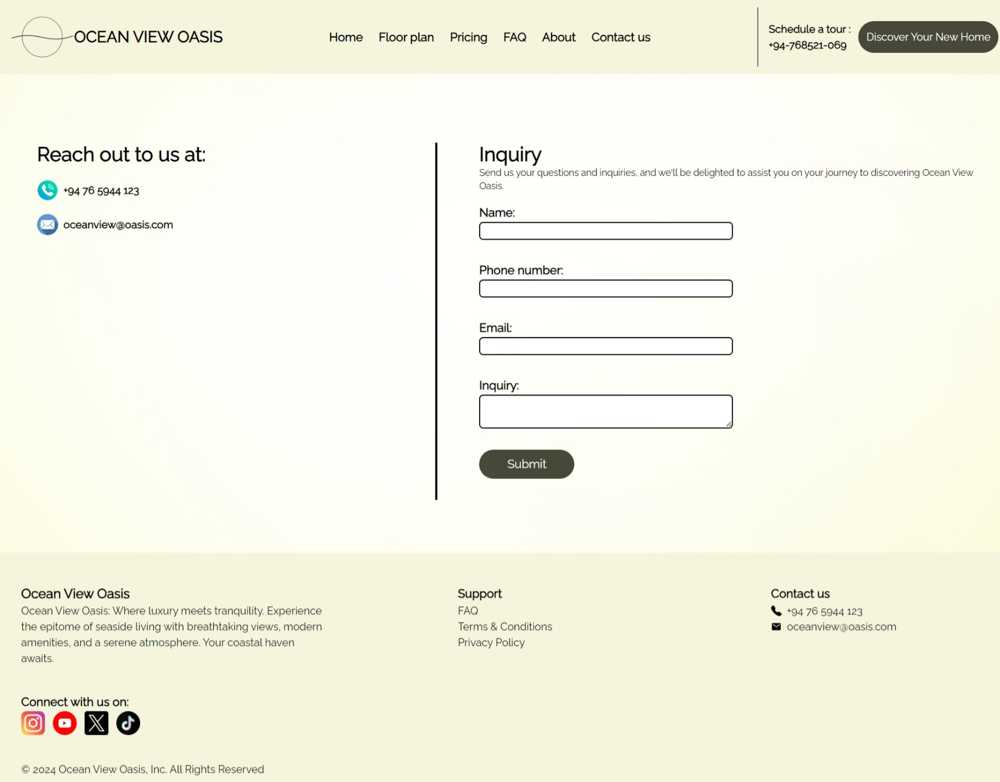

# About the project

Ocean View Oasis is a website for an apartment complex.

## Technologies used

React.js for frontend development
Tailwind CSS for responsive styling
Framer Motion for animations

## Live demo

[Live demo link](https://master--ocean-view-oasis.netlify.app/)

## Screenshots of the project

### Homepage

### Floorplan page

### Pricing page

### FAQ page

### About page

### Contact page

